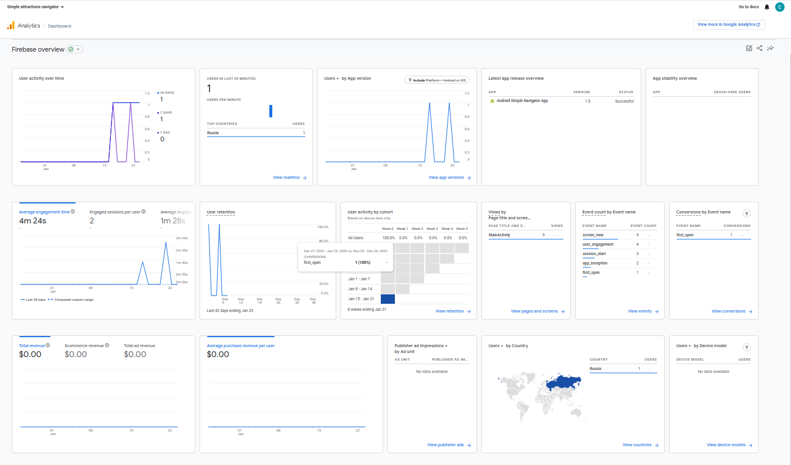
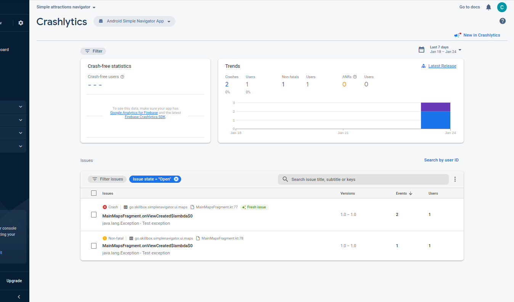

# Цели практической работы
- Применить знания по Location и работе с картой.
- Применить знания о работе с Firebase к проекту.
- Закрепить на практике принципы работы с сервисом Crashlytics и уведомлениями, сообщениями от сервиса Firebase.


# Что входит в задание
- Создать экран с картой.
- Сделать так, чтобы на этом экране отображалось текущее местоположение пользователя на карте.
- Расположить на карте достопримечательности, используя маркеры. Чтобы это сделать, нужны данные о достопримечательностях. Сделайте список самостоятельно или загрузите по API (например, используйте OpenTripMap API).
- Сделать так, чтобы при нажатии на маркер открывалась «Информация по объекту».
- Сделать так, чтобы на экране отображались кнопки масштабирования и текущего местоположения.
- Подключить Firebase к проекту.
- Настроить проект для получения отчётов о сбоях и ошибках, происходящих в приложении.
- Настроить проект для получения пуш-уведомлений от сервиса Firebase.
- Добавить сервис для обработки пуш-сообщений.


# Подготовка к работе
Убедитесь, что девайс или эмулятор поддерживают google-services: без этого не будет возможности протестировать работу пуш-уведомлений. Для выполнения практической работы вы можете установить на эмулятор образ Android, включающий в себя google-services.


# Результат
- При запуске загружаетс карта, фокус смещается к местоположению пользователя. Подгружаются маркеры достопримечательностей в видимой области карты.
- Приложение подключено к firebase analytics, crashlytics, messages.
- Отправка оповещения при активном приложении, а также формирование тестового краша приложения заключено в обработчике нажатия в области TextView скорости на карте. Чтобы спровоцировать исключение, необходимо раскомментировать часть кода:
```
binding?.speedTextView?.setOnClickListener {
            checkPermissions()
//            FirebaseCrashlytics.getInstance().log("Crashlytics log")
//            try {
//                throw Exception("Test exception")
//            }catch (ex: Exception) {
//                FirebaseCrashlytics.getInstance().recordException(ex)
//            }
        }
```

**Скриншоты dashboard и crashlytics**




